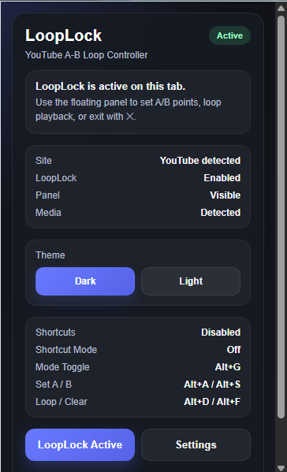
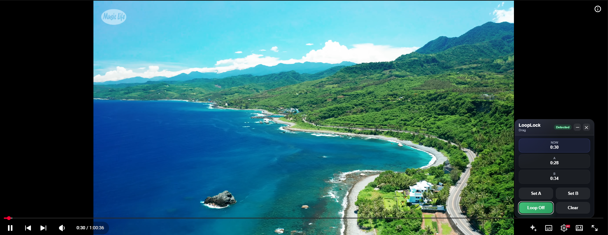
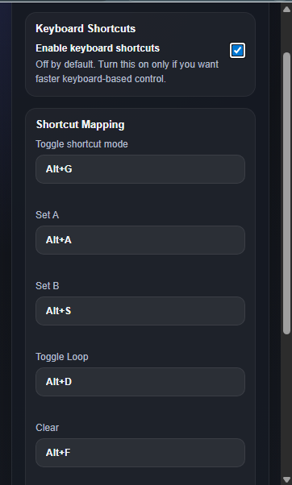
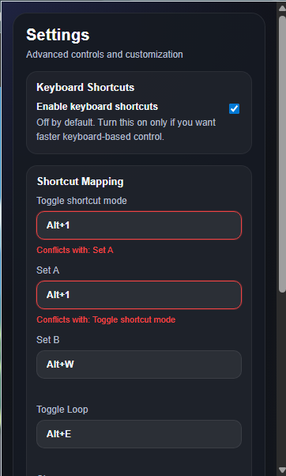

# LoopLock


> A lightweight Chrome / Edge extension for setting and replaying custom A-B loop segments on YouTube watch pages.

LoopLock is built for people who replay specific video moments again and again — especially:

- ASMR listeners
- language learners
- music and audio repeat users
- anyone reviewing short clips or spoken phrases repeatedly

Current direction is intentionally focused:

**Make the YouTube watch-page looping experience stable, clean, and product-like before expanding further.**

---

## Project Status

LoopLock is currently in a **YouTube-first MVP Alpha** stage.

Current priorities:
- keep the popup and session flow stable
- improve shortcut UX through small, low-risk iterations
- continue polishing documentation and project presentation
- avoid broad expansion until the core YouTube watch-page experience is fully reliable

This project is intentionally being developed with a **stability-first** approach.

---

## Overview

LoopLock lets you:

- set an **A point**
- set a **B point**
- loop only that segment
- control the session through a compact floating panel
- optionally use keyboard shortcuts for faster operation

This project is currently in a **YouTube-first MVP Alpha** stage.

---

## Highlights

- **Popup-first product flow**  
  LoopLock starts from the extension popup instead of auto-injecting itself into every page interaction.

- **Clean floating panel UX**  
  Compact, draggable, collapsible, and designed to feel like a real product instead of a rough dev tool overlay.

- **Safe session model**  
  New YouTube video = new loop session.  
  Pause does not destroy your A/B points.

- **Theme sync**  
  Popup and floating panel stay aligned in dark / light mode.

- **Optional shortcuts**  
  Keyboard shortcuts are configurable, but intentionally conservative for stability.

---

## Demo / Screenshots

### Popup Main View
The popup acts as the official entry point for the LoopLock session.



### Floating Panel
LoopLock’s floating panel lets users set A/B points, toggle loop playback, clear the current range, and keep the panel visible while watching.



### Runtime Shortcut Sync
The popup surfaces current shortcut status, runtime sync state, and shortcut mode visibility for the active tab.



### Shortcut Conflict Feedback
Conflicting shortcut mappings are highlighted inline with direct field-level warnings for better clarity.



Below are a few snapshots from the current MVP build, covering the popup entry flow, floating panel controls, runtime shortcut visibility, and inline shortcut conflict feedback.

---

## Current Scope

### Supported
- YouTube watch pages
- Manual A-B loop setup
- Popup-driven session start
- Floating control panel
- Dark / light theme sync
- Persistent floating panel position
- Optional keyboard shortcuts
- Inline shortcut conflict warnings in settings

### Not Supported Yet
- Generic HTML5 video players
- Bilibili
- Universal multi-site support
- Dedicated options page
- Advanced loop analytics or timeline widgets

---

## Feature Set

### Core Loop Controls
- **Set A**
- **Set B**
- **Toggle Loop**
- **Clear**

### Session Lifecycle
- LoopLock does **not** auto-start when a page opens
- Floating panel does **not** auto-open by default
- User explicitly starts the session from popup
- Closing with **✕** exits the whole LoopLock session

### Video Change Behavior
When a different YouTube video loads, LoopLock resets:
- A point
- B point
- Loop state

This is intentional and treated as a new session.

### Pause Behavior
Pausing the video does **not** reset:
- A point
- B point
- Loop state

### Floating Panel
- draggable
- collapsible
- compact layout
- persistent saved position

### Theme
- Dark mode
- Light mode

Popup and floating panel stay synchronized.

---

## Usage

### Start LoopLock
1. Open a YouTube watch page
2. Click the extension icon
3. Click **Open LoopLock**

This enables LoopLock and opens the floating panel.

### Close LoopLock
Click **✕** on the floating panel.

This is not just a visual hide action — it exits the current LoopLock session.

### Set a Loop
1. Play or scrub to the desired start point
2. Click **Set A**
3. Move to the desired end point
4. Click **Set B**
5. Toggle loop on

---

## Keyboard Shortcuts

Keyboard shortcuts are optional and **Off by default**.

You must enable them manually in **Settings**.

### Default Mapping
- `Alt+G` → Toggle shortcut mode
- `Alt+A` → Set A
- `Alt+S` → Set B
- `Alt+D` → Toggle Loop
- `Alt+F` → Clear

### Custom Mapping
Shortcut mappings can be customized in popup settings.

### Shortcut Rules
- Shortcuts only work when the **YouTube page itself is focused**
- If the **extension popup is focused**, page-level shortcuts will not fire
- Clearing a shortcut field restores it to the default value
- If two actions are assigned the same shortcut:
  - the conflicting fields are highlighted
  - inline conflict warnings appear directly on those fields

### Current Stability Note
Shortcut behavior is intentionally handled conservatively to avoid breaking the main popup, session, and floating-panel flow.

The current design prioritizes:
- stable page interaction
- predictable focus behavior
- safer incremental refinement over risky shortcut rewrites

---

## Known Behaviors / Current Product Rules

The following behaviors are currently intentional and should not be treated as bugs unless the product direction changes:

- **Popup is the official entry point**  
  LoopLock does not auto-start on page load and does not auto-open the floating panel by default.

- **Floating panel close (✕) exits the full session**  
  This action is not just a visual hide. It closes the current LoopLock session and clears current loop state.

- **New YouTube video = new session context**  
  When the YouTube video changes, LoopLock resets A/B points and loop state intentionally.

- **Pause does not reset loop state**  
  Pausing playback should not clear A, B, or the current loop-enabled state.

- **Shortcuts are optional and conservative by design**  
  Keyboard shortcuts are Off by default and must be enabled manually from popup settings.

- **Shortcut settings are currently popup-local**  
  Shortcut configuration is intentionally kept isolated from shared storage integration for stability during the current MVP phase.

- **Page shortcuts only fire when the page itself has focus**  
  If the extension popup is focused, page-level shortcuts will not trigger. This is a currently accepted product behavior.

- **Clearing a shortcut field restores its default value**  
  Empty shortcut inputs are normalized back to the current default mapping instead of remaining blank.

- **Conflict warnings are informational and local to popup settings**  
  Shortcut conflicts are surfaced through field-level warnings and visual highlighting, without changing the core session model.

- **Floating panel updates should remain non-destructive after mount**  
  The panel is expected to mount once and update in place, rather than being repeatedly rebuilt from scratch.

---

## UX Rules

These are currently intentional product rules:

- popup is the official entry point
- floating panel is not always-on by default
- no auto-enable on page load
- no auto-open on page load
- new video resets loop state
- pause does not reset loop state
- theme sync must remain consistent between popup and floating panel
- floating panel should update without destructive full DOM rebuilds after mount

---

## Installation

### Development Setup

```bash
npm install
npm run build